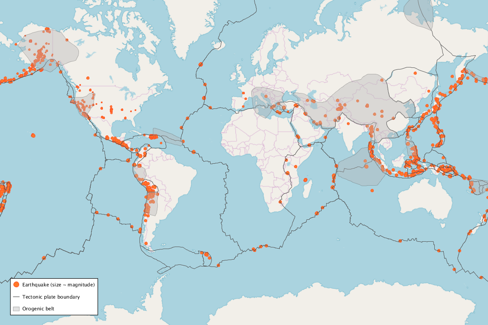

# TectonicsMap

After finishing my final assignment for the Coursera course *[Object Oriented Programming in Java](https://www.coursera.org/learn/object-oriented-java)*, I wanted to publish the code that I had written for the part of the assignment where we were asked to get creative and extend the earthquake map implemented throughout the course by adding some functionality of our own choosing.

To steer clear of publishing copyrighted material, I wrote my own simplified version of the map from scratch. It is called *TectonicsMap*, and it projects earthquakes in the past 30 days onto the world map using data from the U.S. Geological Survey (USGS). Additionally, it implements the extension that I had written for the assignment: the boundaries of tectonic plates and orogenic belts (zones where mountains are being formed) are projected onto the map, thus providing information about where earthquakes are likely to occur. All of this information is drawn from GeoJSON files that are available online.

## References

- Inspired by the Coursera course *[Object Oriented Programming in Java](https://www.coursera.org/learn/object-oriented-java)* taught by Christine Alvarado, Mia Minnes and Leo Porter
- Recent earthquake data from the U.S. Geological Survey (USGS), <https://earthquake.usgs.gov/>
- Original data from Peter Bird, An updated digital model of plate boundaries (2003). Geochemistry Geophysics Geosystems, 4(3), 1027. [doi:10.1029/2001GC000252](https://doi.org/10.1029/2001GC000252)
- Data was cleaned and edited by Hugo Ahlenius and published on <https://github.com/fraxen/tectonicplates>
- Data was converted to GeoJSON files by Corey Sterling <https://github.com/csterling>
- Uses the [Processing](https://processing.org/) and [Unfolding Maps](http://unfoldingmaps.org/) libraries